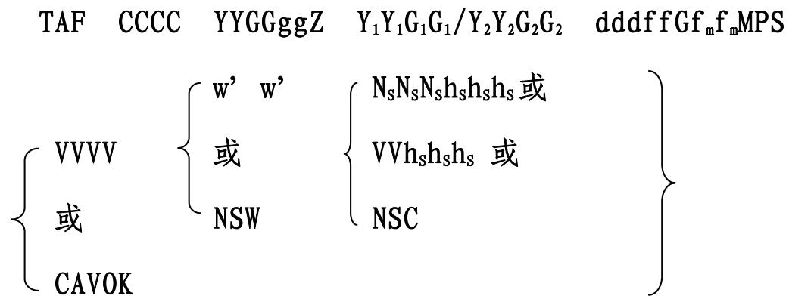
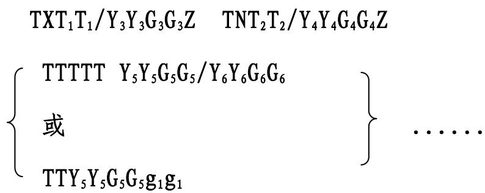

# 第二章 机场预报

# 第一节 一般规定

第七条 机场预报应当包含对机场特定时段内预期气象情况的简要说明，并在特定的时间发布。

第八条 机场预报应当按照《附录二 机场预报编报规则》和《附录三 机场预报模板和报文示例》的规定编报。机场预报以“TAF”标明。

第九条 机场预报包括以下内容：

（一）预报类型标识；

（二）地名代码；

（三）预报的发布日期和时间；

（四）预报缺报标识（适用时）；

（五）预报的有效日期和时段；

（六）预报取消标识（适用时）；

（七）地面风；

（八）能见度；

（九）天气现象；

（十）云；

（十一）有效时段内最高和最低气温；

（十二）在有效时段内一个或多个上述气象要素预期的重大变化。

第十条 机场预报的有效时段应当不小于 9 小时，不大于 30 小

时。有效时段小于 12小时的机场预报应当每 3小时发布一次；有效时段为 12 小时至 30 小时的机场预报应当每 6 小时发布一次。

第十一条 为国内飞行提供服务的机场气象台应当编制和发布 9小时机场预报（FC），为国际和地区飞行提供服务的机场气象台应当编制和发布 24 小时或 30 小时机场预报（FT）。编制和发布 24 小时或30 小时机场预报（FT）的机场气象台不再编制和发布 9 小时机场预报（FC）。

第十二条 9 小时机场预报（FC）有效时段为 2106、0009、0312、0615、0918、1221、1524 和 1803；24 小时机场预报（FT）有效时段为 0024、0606、1212 和 1818；30 小时机场预报（FT）有效时段为0006、0612、1218 和 1824。

第十三条 当连续两份或者两份以上 FC/FT 的有效时段的起始时间之间没有飞行活动时，可以只发布最后一份 FC/FT，但应当在飞行活动开始前 3 小时发布。

第十四条 新发布的机场预报，应当理解为自动取消之前所发布的同一类型、同一机场、同一有效时段或有效时段一部分的机场预报。

# 第二节 气象要素的预报

第十五条 地面风的预报，应当报出预期盛行的风向、风速。风向精度为 10 度，风速单位为米/秒。

由于预期风向多变而不可能预报一个盛行的地面风向时，例如在微风（2 米/秒以下）或雷暴的情况下，风向应当预报为风向不定。

当预报风速小于 0.5 米/秒时，地面风应当预报为静风；当预报风速最大值超过预报平均风速 5 米/秒或以上时，应当预报为阵风，并给出阵风值。

地面风预报的编报见《附录二 机场预报编报规则》“2.5 风组”。

第十六条 能见度的预报，应当预报主导能见度，计量单位为米。能见度应当按下列增量等级编报：

（一）小于 800 米时，以 50 米为等级编报；

（二）大于或等于 800 米且小于 5000 米时，以 100 米为等级编报；

（三）大于或等于 5000 米且小于 10000 米时，以 1000 米为等级编报；

（四）大于或等于 10000 米时，报告“9999”（但适用“CAVOK”的条件时除外）。

不符合所用编报规定的预报值，应当向下取最接近的增量等级数值编报。

能见度预报的编报见《附录二 机场预报编报规则》“2.6 主导能见度组”。

第十七条 天气现象的预报，应当描述天气现象的强度、特征及类型，最多预报三种天气现象或天气现象的组合。天气现象的强度、特征及类型包括：

# （一）强度描述

弱∕小（-）：用于弱降水的描述；

中: 用于中度降水或中度沙暴和尘暴，不使用符号表示；

强∕大（+）: 用于强降水、强的沙暴和尘暴的描述。

# （二）特征描述

雷暴（TS）：用于描述伴有雷暴的降水，也可以单独使用表示有雷暴而无降水；

冻结（FZ）：用于描述过冷水滴或冻降水；

阵性（SH）：用于描述阵性降水;

高吹（BL）：被风吹到地面上空 2 米或以上高度;

低吹（DR）：被风吹到地面上空 2 米以下高度;

浅的（MI）：用于描述离地面 2 米以内的雾；

碎片的（BC）：用于描述碎片状的雾；

部分的（PR）：用于描述机场的重要部分被雾覆盖，其余部分清晰。

# （三）天气类型

# 1. 降水类

毛毛雨（DZ）；

雨（RA）；

雪（SN）；

米雪（SG）；

冰粒（PL）；

雹（GR）：当最大雹块直径等于或大于 5 毫米时；

小冰雹和∕或霰（GS）：当最大雹块直径小于 5 毫米时。

# 2. 视程障碍现象类

雾（FG）：当能见度低于 1000 米时；

轻雾（BR）：当能见度大于等于 1000 米但小于等于 5000 米时；

沙（SA）、尘（DU）、霾（HZ）、烟（FU）：由大气尘粒组成，且能见度等于或低于 5000 米时；

低吹沙（DRSA）、低吹尘（DRDU）、低吹雪（DRSN）、火山灰（VA）不受能见度限制。

# 3. 其他类

尘∕沙卷风（PO）；

飑（SQ）；

漏斗云∕陆龙卷或水龙卷（FC）；

尘暴（DS）；

沙暴（SS）。

天气现象预报的编报见《附录二 机场预报编报规则》“ 2.7 天气现象组”。

第十八条 云的预报，应当包括云量、云底高度（以下简称云高）和云状，当预期天空状况不明或变为不明，无法预报云，而机场有有效的垂直能见度的情报时，应当预报垂直能见度。

云量的预报应使用八分量的计量方式描述；云状的预报仅限于积雨云和浓积云。

云和垂直能见度预报的编报见《附录二 机场预报编报规则》

“ 2.8 云/垂直能见度组”。 

第十九条 气温的预报，应当给出预报有效时间内最高和最低气温以及预计出现的时间。有效时间为 30 小时的预报应当给出日最高和最低气温以及预计出现的时间。

气温预报的编报见《附录二 机场预报编报规则》“2.10 气温组”。

# 第三节 变化组指示码及使用方式

第二十条 对预报内容中所列的任何气象要素的重大变化，使用指示码“BECMG”、“TEMPO”和“FM”表示。

第二十一条 变化组的数目应当保持最少，通常不超过五组。

第二十二条 “BECMG”用于描述气象要素以规则或不规则的速度达到或经过特定值的预期变化，“BECMG”描述的变化时段不应超过 2 小时。

第二十三条 “TEMPO”用于描述气象要素达到或经过特定值的预期短暂波动，每次波动持续时间应当不超过 1 小时，并且波动所占时间应当小于预期发生波动的预报时段的一半。

第二十四条 “BECMG”与“TEMPO”后紧接预期发生变化的时段，该时段使用 8 位数字表示协调世界时（UTC）的日期和小时整数，前四位表示起始日期和小时，后四位表示变化或终止日期和小时，中间用“/”分隔。

第二十五条 当预期天气情况将有重大变化，几乎变成完全不同的天气情况时，有效时段可以细分成几个独立部分，用“FM”及其后

紧跟的预期变化发生的时间组来表示，时间组是协调世界时（UTC）的日期、小时和分钟 6 位数字。“FM”后面的细分时段应当是独立的，风、能见度、天气现象、云组均需重新编报，所有在“FM”前面的预报情况应当被“FM”后面的情况所替代。

第二十六条 当多个变化组连用时，按开始时间依次排序。如果“BECMG”或“FM”与“TEMPO”的开始时间相同，则“BECMG”或“FM”优先。

第二十七条 变化组的编报及使用条件见《附录二 机场预报编报规则》“2.11 变化组”、“3 机场预报的修订条件、变化组的使用条件”和“4 关于变化组的补充说明”。

# 第四节 机场预报的修订、取消和更正

第二十八条 编制机场预报的气象台应当不断检查已发布的 TAF报。当达到修订条件时，应当发布修订预报；当不能持续检查已发布的 TAF 报时，应当对已发布机场预报予以取消；当发现已发布的 TAF报文格式、字符等有错误时，应当对已发布的机场预报予以更正。

第二十九条 机场预报的修订、取消和更正的有效时段，应当与所修订、取消和更正的机场预报的有效时段一致。发布修订预报时，未达到修订条件的组也可以与原报文不同。

第三十条 当发布机场预报的修订报时，应当在其报头时间组后加注“AAA”（对同一份报的后续修订依次为“AAB”、“AAC”……）字样。

当发布机场预报更正报时，应当在其报头时间组后加注— 8 —

“CCA”（对同一份报的后续更正依次为“CCB”、“CCC”……）字样。

第三十一条 修订预报的发布条件见《附录二 机场预报编报规则》“3 机场预报的修订条件、变化组的使用条件”。


# 附录二

# 机场预报编报规则

# 1 电码格式

机场预报（TAF）的电码格式如下：







# 2 编报规则

# 2.1 TAF 组

机场预报的修订和取消用报头 TAF AMD 代替 TAF；机场预报的更正用报头 TAF COR 代替 TAF。

# 2.2 CCCC 组（地名代码组）

应当使用国际民航组织（ICAO）规定的地名代码编报 CCCC 组。

# 2.3 YYGGggZ 组（发布日期和时间组）

在一份公报中，每份独立的 TAF，应当包括发布日期和时间（日期、小时和分钟使用 UTC 编报），其后不加空格紧跟着指示码 Z。

# 2.4 $\Upsilon _ { 1 } \Upsilon _ { 1 } \mathfrak { G } _ { 1 } \mathfrak { G } _ { 1 } / \Upsilon _ { 2 } \Upsilon _ { 2 } \mathfrak { G } _ { 2 } \mathfrak { G } _ { 2 }$ 组（预报有效时段组）

预报应当覆盖 $\mathsf { Y } _ { 1 } \mathsf { Y } _ { 1 } \mathsf { G } _ { 1 } \mathsf { G } _ { 1 }$ 至 $\bar { \mathsf { Y } } _ { 2 } \bar { \mathsf { Y } } _ { 2 } \bar { \mathsf { G } } _ { 2 } \bar { \mathsf { G } } _ { 2 }$ 期间的整个时段，可以用时间指示组 $\mathtt { F M } \mathtt { Y } _ { 5 } \mathtt { Y } _ { 5 } \mathtt { G } _ { 5 } \mathtt { G } _ { 5 } \mathtt { g } _ { 1 } \mathtt { g } _ { 1 }$ 将整个预报时段分为两个或几个独立部分。对主要气象状况完整的预报描述应当放在一份预报的开头或每个独立部分。若预计某些要素将在预报时段内或某个独立部分时段内有重大变化，在对变化前主要气象状况预报完整的描述之后，应当加编一个或几个变化组 BECMG $\Upsilon _ { 5 } \Upsilon _ { 5 } \mathrm { G } _ { 5 } \mathrm { G } _ { 5 } / \Upsilon _ { 6 } \Upsilon _ { 6 } \mathrm { G } _ { 6 } \mathrm { G } _ { 6 }$ 或 TEMPO Y5Y5G5G5/Y6Y6G6G6。

# 2.5 dddffGfmfm MPS 组 （风组）

预报的平均风向和平均风速应当使用 dddff，其后不加空格紧接简语 MPS 编报。

a) 当预报风速小于 0.5 米/秒时，预报的地面风用静风表示，编报为“00000”，其后不加空格紧跟简语 MPS。

b) 由于预期风向多变而不能预报一个盛行的地面风向时，例如在微风（2 米/秒以下）或雷暴的情况下，编报“VRB”。

c) 当所预报的最大风速超过平均风速 5 米/秒或以上时，应当紧接 dddff 之后加报 $\mathsf { G f } _ { \mathtt { m } } \mathbf { f } _ { \mathtt { m } }$ 来表示阵风。

d) 当预报风速大于等于 50 米/秒时，“ff”组前加指示码 P，编报 P49MPS。

# 2.6 VVVV 组（主导能见度组）

VVVV 组按照能见度的数值编报，固定为四位数字，当能见度数值不足四位数时，在其前以 $" 0 ^ { \dag }$ 补满四位。

2.7 w′w或 组 （天气现象组）NSW

a) $\mathbf { w } ^ { \prime } \mathbf { \Sigma } \mathbf { w } ^ { \prime }$ ′组按照强度、特征、天气类型顺序组成。例如：+TSRA。

b) 一种以上的降水现象相伴出现时，其中主要的降水现象先编报。例如： $+ { \tt S N R A }$ 。

c) 每个 $\mathbf { w } ^ { \prime } \mathbf { \Sigma } \mathbf { w } ^ { \prime }$ 组中只能有一个特征描述。例如：-FZDZ。

d) DR（低吹）适用于由风吹起的不超过地面以上 2 米的尘、沙或雪现象。BL（高吹）适用于由风吹起 2 米或以上高度的尘、沙或雪现象。DR 和 BL 只能与 DU、SA 和 SN 简语结合使用。例如：BLSN。

e) SH 只能与简语 RA、SN、SG、GS 和 GR 中的一个或几个结合使用，以表示有阵性降水。例如：SHSN。

f) TS 只能与简语 RA、SN、PL、SG、GS 和 GR 中的一个或几个结合使用，以表示机场有雷暴并伴有降水。例如：TSSNGS。

g) FZ 只能与简语 FG、DZ 和 RA 结合使用。例如：FZRA。

h) 当多种天气类型同时出现时，按降水类、视程障碍现象类、其他类顺序编报。例如：RA FG。

i) 使用简语 NSW 编报天气现象组，表示重要天气现象全部结束。

2.8 NSNSNShShShS 或VVhShShS 或 组 （云/垂直能见度组）NSC

a) 使用简语 FEW、SCT、BKN 和 OVC 编报 $\mathtt { N } _ { \mathtt { s } } \mathtt { N } _ { \mathtt { s } } \mathtt { N } _ { \mathtt { s } } \mathtt { h } _ { \mathtt { s } } \mathtt { h } _ { \mathtt { s } } \mathtt { h } _ { \mathtt { s } }$ 组，分别表示少云（1～2 个八分量）、疏云（3～4 个八分量）、多云（5～7 个八分量）和阴天（8 个八分量），其后不加空格紧接云高 hShShS编报。

b) 云组中， ${ \tt N } _ { \tt S } { \tt N } _ { \tt S } { \tt N } _ { \tt S }$ 应当编报预期在 hShShS高度上出现的积雨云和浓积云外的总云量。

c) 云组可以编报表示不同云层或云块的预报，一般不超过三组，除非预报有应当编报的积雨云/浓积云组。

d) 预报的云层或云块应当按下列要求选择编报：

第 1 组：任何云量的最低单独云层（块），编报为 FEW、SCT、BKN或 OVC；

第 2 组：云覆盖超过 2 个八分量的次高单独云层（块），编报为SCT、BKN 或 OVC；

第 3 组：云覆盖超过 4 个八分量的更高单独云层（块），编报为BKN 或 OVC；

附加组：当预报有积雨云（CB）或浓积云（TCU），且未在上述 3组中编报时，应当编报本组。

这些组应当按从低到高的次序编报，并只编报对飞行有重要影响的云。

e) 预报云层（块）的云高 hShShS，应当以 30 米为一个增量等级编报。

f) 除积雨云和浓积云外，所预报的其它云不需说明云状。当预报有积雨云或浓积云时，应不加空格紧接云组之后编报简语 CB 或 TCU说明。当预报有相同云底高的积雨云和浓积云时，则云状只编报 CB，云量按 CB 和 TCU 的总和编报。

g) 当天空状况不明，无法预报云，但有垂直能见度的情报时，应用 $\mathtt { V h } _ { \mathtt { s } } \mathtt { h } _ { \mathtt { s } } \mathtt { h } _ { \mathtt { s } }$ 组代替 $\mathrm { N _ { s } N _ { s } N _ { s } h _ { s } h _ { s } h _ { s } }$ 组编报，其中 hShShS为垂直能见度，以30 米为一个增量等级编报。当无法预计垂直能见度时，可以用“VV///”表示。

h) 当预报 1500 米或最高的最低扇区高度（两者取其大）以下无云、天空没有积雨云或浓积云、CAVOK 不适用时，应当使用简语 NSC表示。

# 2.9 CAVOK 组

当预期同时适合下列条件时，编报简语 CAVOK 代替 VVVV、w′w以及 $\mathtt { N } _ { \mathtt { s } } \mathtt { N } _ { \mathtt { s } } \mathtt { N } _ { \mathtt { s } } \mathtt { h } _ { \mathtt { s } } \mathtt { h } _ { \mathtt { s } } \mathtt { h } _ { \mathtt { s } } \mathtt { h } _ { \mathtt { s } }$ 或 VVhShShS 组：

a）能见度大于或等于 10000 米；

b）1500 米或者最高的最低扇区高度（两者取其大）以下无云，而且天空没有积雨云或浓积云；

c）无天气现象。

2.10 TXT1T1／Y3Y3G3G3Z TNT2T2／Y4Y4G4G4Z 组 （气温组）

使用 $\bar { \mathsf { Y } } _ { 3 } \bar { \mathsf { Y } } _ { 3 } \bar { \mathsf { G } } _ { 3 } \bar { \mathsf { G } } _ { 3 }$ 和 $\pmb { \mathrm { Y } } _ { 4 } \pmb { \mathrm { Y } } _ { 4 } \pmb { \mathrm { G } } _ { 4 } \pmb { \mathrm { G } } _ { 4 }$ 表示最高和最低气温预计出现的时间。简语 TX 是预报时段内的最高气温指示码，TN 是预报时段内的最低气温指示码，其后不加空格紧接着分别编报预报的最高、最低气温值。

气温在 $- 9 \mathrm { ‰ }$ （含）至 $+ 9 \mathrm { { ^ \circ C } }$ （含）之间，应当在该值前加 0 编报；气温低于 $0 \%$ ，则在该值前加字符 M 编报，表示负值。

在预报有效时段内出现相同的最高气温或最低气温时，以首个出现时间编报。30 小时机场预报编报两组 $\mathrm { T X T _ { 1 } T _ { 1 } } / \mathrm { Y } _ { 3 } \mathrm { Y } _ { 3 } \mathrm { G } _ { 3 } \mathrm { G } _ { 3 } \mathrm { Z }$ 和一组$\mathrm { T N T _ { 2 } T _ { 2 } } / \mathrm { Y } _ { 4 } \mathrm { Y } _ { 4 } \mathrm { G } _ { 4 } \mathrm { G } _ { 4 } \mathrm { Z }$ 或者编报两组 $\mathrm { T N T } _ { 2 } \mathrm { T } _ { 2 } / \mathrm { \Delta Y } _ { 4 } \mathrm { Y } _ { 4 } \mathrm { G } _ { 4 } \mathrm { G } _ { 4 } \mathrm { Z }$ 和一组 $\mathrm { T X T _ { 1 } T _ { 1 } } / \mathrm { Y _ { 3 } Y _ { 3 } G _ { 3 } G _ { 3 } } \mathrm { Z } .$ 。

2.11 $\left\{ \begin{array} { l l } { \mathrm { T T T T T } } & { \Upsilon _ { 5 } \Upsilon _ { 5 } \Upsilon _ { 5 } \mathfrak { G } _ { 5 } \mathfrak { G } _ { 5 } / \Upsilon _ { 6 } \Upsilon _ { 6 } \mathfrak { G } _ { 6 } \mathfrak { G } _ { 6 } } \\ { \qquad } \\ { \Xi \qquad } \\ { \quad } \\ { \mathrm { T T Y } _ { 5 } \Upsilon _ { 5 } \mathfrak { G } _ { 5 } \mathfrak { G } _ { 5 } \mathfrak { g } _ { 1 } \mathfrak { g } _ { 1 } } \end{array} \right.$组 （变化组）

a) 在预报的有效时段（ $\mathtt { Y } _ { 1 } \mathtt { Y } _ { 1 }$ 日 $\mathsf { G } _ { 1 } \mathsf { G } _ { 1 }$ 时至 $\mathtt { Y } _ { 2 } \mathtt { Y } _ { 2 }$ 日 $\mathsf { G } _ { 2 } \mathsf { G } _ { 2 }$ 时）内，当预计部分或全部要素在某一中间时刻 $\Upsilon _ { 5 } \Upsilon _ { 5 }  { \mathrm { G } } _ { 5 }  { \mathrm { G } } _ { 5 }  { \mathbf { g } } _ { 1 }  { \mathbf { g } } _ { 1 }$ 或在 $\mathtt { Y } _ { 5 } \mathtt { Y } _ { 5 } \mathtt { G } _ { 5 } \mathtt { G } _ { 5 }$ 至 $\pmb { \mathrm { Y } } _ { 6 } \pmb { \mathrm { Y } } _ { 6 } \pmb { \mathrm { G } } _ { 6 } \pmb { \mathrm { G } } _ { 6 }$时段内发生重大变化，或者 $\mathtt { Y } _ { 5 } \mathtt { Y } _ { 5 } \mathtt { G } _ { 5 } \mathtt { G } _ { 5 }$ 至 $\pmb { \mathrm { Y } } _ { 6 } \pmb { \mathrm { Y } } _ { 6 } \pmb { \mathrm { G } } _ { 6 } \pmb { \mathrm { G } } _ { 6 }$ 时段气象状况有短暂波动，应当编报此组。在 $\mathtt { Y } _ { 5 } \mathtt { Y } _ { 5 } \mathtt { G } _ { 5 } \mathtt { G } _ { 5 }$ 至 $\mathbf { Y } _ { 6 } \mathbf { Y } _ { 6 } \mathbf { G } _ { 6 } \mathbf { G } _ { 6 }$ 时段内或在 $\Upsilon _ { 5 } \Upsilon _ { 5 }  { \mathrm { G } } _ { 5 }  { \mathbf { G } } _ { 5 }  { \mathbf { g } } _ { 1 }  { \mathbf { g } } _ { 1 }$ 时刻前已编报所有有必要描述的要素预报数据后，才编报此组。如果预报时段终止于协调世界时日界，则 $\mathsf { G } _ { 6 } \mathsf { G } _ { 6 }$ 编报为 24。

b) 时间指示组 $\operatorname { T T Y } _ { 5 } \mathbf { Y } _ { 5 } \mathbf { G } _ { 5 } \mathbf { G } _ { 5 } \mathbf { g } _ { 1 } \mathbf { g } _ { 1 }$ 编报为 $\mathrm { F M Y } _ { 5 } \mathrm { Y } _ { 5 } \mathrm { G } _ { 5 } \mathrm { G } _ { 5 } \mathrm { \bf g } _ { 1 } \mathrm { \bf g } _ { 1 }$ 形式，用来描述一份预报中某个独立部分开始时间 $\Upsilon _ { 5 } \Upsilon _ { 5 }  { \mathrm { G } } _ { 5 }  { \mathbf { G } } _ { 5 }  { \mathbf { g } } _ { 1 }  { \mathbf { g } } _ { 1 } ,$ 。使用 $\mathrm { F M Y } _ { 5 } \mathrm { Y } _ { 5 } \mathrm { G } _ { 5 } \mathrm { G } _ { 5 } \mathrm { \bf g } _ { 1 } \mathrm { \bf g } _ { 1 }$ 组时，该组之前的预报状况将全部由 $\mathrm { F M Y } _ { 5 } \mathrm { Y } _ { 5 } \mathrm { G } _ { 5 } \mathrm { G } _ { 5 } \mathrm { \bf g } _ { 1 } \mathrm { \bf g } _ { 1 }$ 组之后的预报状况所取代。

c) 变化组 TTTTT $\Upsilon _ { 5 } \Upsilon _ { 5 } \mathrm { G } _ { 5 } \mathrm { G } _ { 5 } / \Upsilon _ { 6 } \Upsilon _ { 6 } \mathrm { G } _ { 6 } \mathrm { G } _ { 6 }$ 编报为 BECMG $\Upsilon _ { 5 } \Upsilon _ { 5 }  { \mathrm { G } } _ { 5 }  { \mathrm { G } } _ { 5 } /  { \mathrm { ~ \ y ~ } } _ { 6 }  { \mathrm { Y } } _ { 6 }  { \mathrm { G } } _ { 6 }  { \mathrm { G } } _ { 6 }$形式，用来描述预报的气象状况在 $\mathtt { Y } _ { 5 } \mathtt { Y } _ { 5 } \mathtt { G } _ { 5 } \mathtt { G } _ { 5 }$ 至 $\pmb { \mathrm { Y } } _ { 6 } \pmb { \mathrm { Y } } _ { 6 } \pmb { \mathrm { G } } _ { 6 } \pmb { \mathrm { G } } _ { 6 }$ 时段内的某个时间预期以规则或不规则的速度发生变化。 $\mathtt { Y } _ { 5 } \mathtt { Y } _ { 5 } \mathtt { G } _ { 5 } \mathtt { G } _ { 5 }$ 至 $\boldsymbol { \mathrm { Y } } _ { 6 } \boldsymbol { \mathrm { Y } } _ { 6 } \boldsymbol { \mathrm { G } } _ { 6 } \boldsymbol { \mathrm { G } } _ { 6 }$ 时段应不超过 2 小时。变化组之后应当编报预报有变化的所有要素。如变化组之后没有描述某一要素，则认为在 $\mathsf { Y } _ { 1 } \mathsf { Y } _ { 1 } \mathsf { G } _ { 1 } \mathsf { G } _ { 1 }$ 至 $\mathtt { Y } _ { 5 } \mathtt { Y } _ { 5 } \mathtt { G } _ { 5 } \mathtt { G } _ { 5 }$ 时段内对该要素的描述继续有效。

d) 在 BECMG $\Upsilon _ { 5 } \Upsilon _ { 5 } \mathrm { G } _ { 5 } \mathrm { G } _ { 5 } / \Upsilon _ { 6 } \Upsilon _ { 6 } \mathrm { G } _ { 6 } \mathrm { G } _ { 6 }$ 组之后所描述的状况是预期从$\pmb { \mathrm { Y } } _ { 6 } \pmb { \mathrm { Y } } _ { 6 } \pmb { \mathrm { G } } _ { 6 } \pmb { \mathrm { G } } _ { 6 }$ 至 $\bar { \mathsf { Y } } _ { 2 } \bar { \mathsf { Y } } _ { 2 } \bar { \mathsf { G } } _ { 2 } \bar { \mathsf { G } } _ { 2 }$ 有效的状况。预期再有新的变化，应当再编报变化组。

e) 变化组 TTTTT $\Upsilon _ { 5 } \Upsilon _ { 5 } \mathrm { G } _ { 5 } \mathrm { G } _ { 5 } / \Upsilon _ { 6 } \Upsilon _ { 6 } \mathrm { G } _ { 6 } \mathrm { G } _ { 6 }$ 编报为 $\mathrm { T E M P 0 } \ : \ : \mathrm { \forall , \ : \mathrm { Y } , \ : G _ { 5 } G _ { 5 } / \ : \ : \mathrm { Y } _ { 6 } \mathrm { Y } _ { 6 } G _ { 6 } G _ { 6 } }$形式，用来描述 $\mathtt { Y } _ { 5 } \mathtt { Y } _ { 5 } \mathtt { G } _ { 5 } \mathtt { G } _ { 5 }$ 至 $\pmb { \mathrm { Y } } _ { 6 } \pmb { \mathrm { Y } } _ { 6 } \pmb { \mathrm { G } } _ { 6 } \pmb { \mathrm { G } } _ { 6 }$ 时段预报的气象状况的频繁的或偶尔的短暂波动，并且每次波动不得超过一小时，其累计所占时间不超过该时段的一半。对于机场预报（FC），“TEMPO”描述的变化时段应当不超过 4 小时；对于机场预报（FT），“TEMPO”描述的变化时段应当不超过 6 小时。如果变动的预报状况预期持续一小时或以上，应当在 该 时 段 的 开 头 和 结 尾 编 报 变 化 组 BECMG $\Upsilon _ { 5 } \Upsilon _ { 5 } \mathrm { G } _ { 5 } \mathrm { G } _ { 5 } / \Upsilon _ { 6 } \Upsilon _ { 6 } \mathrm { G } _ { 6 } \mathrm { G } _ { 6 }$ 或FMY5Y5G5G5g1g1。

# 3 机场预报的修订条件、变化组的使用条件

3.1 机场预报的修订条件和变化组的使用条件相同。

3.2 当预报平均地面风向的变化大于等于 $6 0 ^ { \circ }$ ，且在变化前和（或）变化后平均风速大于等于 5 米/秒时。

3.3 当预报平均地面风速的变化大于等于 5 米/秒时。

3.4 当预报地面风的阵风变化大于等于 5 米/秒，且变化前和

（或）变化后的平均风速大于等于 8 米/秒时。

3.5 当预报能见度上升并达到或经过下列一个或多个阈值，或者下降并经过下列一个或多个阈值时：

a) 150 米、350 米、600 米、800 米、1500 米或 3000 米；

b) 5000 米（当有大量按目视飞行规则的飞行时）。

3.6 当预报下列一种或几种重要天气现象开始、终止或强度变化时：

a) 冻降水；

b) 中或大降水（需要时可以包含阵性或非阵性的小雨或小雪）；

c) 尘暴；

d) 沙暴。

3.7 当预报下列一种或几种重要天气现象开始、终止时：

a) 冻雾；

b) 低吹尘、低吹沙或低吹雪；

c) 高吹尘、高吹沙或高吹雪；

d) 雷暴；

e) 飑；

f) 漏斗云（陆龙卷或水龙卷）。

3.8 当预报 BKN或 OVC云量的最低云层的云高抬升并达到或经过下列一个或多个阈值，或者降低并经过下列一个或多个阈值时：

a) 30 米、60 米、150 米或 300 米；

b) 450 米（在有大量的按目视飞行规则的飞行时）。

3.9 当预报低于 450 米的云层或云块的量的变化满足下列条件之一时：

a) 从 SCT 或更少到 BKN、OVC；

b) 从 BKN、OVC 到 SCT 或更少。

3.10 当预报积雨云发展或消失时。

3.11 当预报垂直能见度上升并达到或经过下列一个或多个阈值，或者下降并经过下列一个或多个阈值时：30 米、60 米、150 米或300 米。

3.12 机场预报的修订条件和变化组的使用条件，还可以包括由民航气象服务机构与民航气象用户协定的风向风速、能见度、云高云量其他阈值和其他天气现象。

# 4 关于变化组的补充说明

4.1 能见度上升并达到或经过，或者下降并经过 3.5 中一个或多个阈值时，若影响能见度的天气现象发生改变则应当编报，若天气现象没有发生改变，则不需编报。

4.2 当 3.6、3.7 中所述的重要天气现象以及与民航气象用户协定的天气现象全部结束，且能见度小于等于 5000 米时，则编报影响能见度的天气现象；当能见度大于 5000 米时，用“NSW”表示。

4.3 云有重大变化时，所有云组（包括预计没有变化的重要云层或云块）都应当编报。

# 附录三

# 机场预报模板和报文示例


1 TAF 模板


<table><tr><td>要素</td><td>详细内容</td><td>模板</td><td>示例</td></tr><tr><td>报告种类的标识(M)</td><td>预报种类(M)</td><td>TAFTAF AMD(修订报)TAF COR(更正报)</td><td>TAF;TAF AMD;TAF COR</td></tr><tr><td>地名代码(M)</td><td>ICAO地名代码(M)</td><td>nnnnn</td><td>ZBAA</td></tr><tr><td>发布预报的日期和时间(M)</td><td>发布预报的日期和时间(协调世界时)(M)</td><td>nnnnnnZ</td><td>160000Z</td></tr><tr><td>缺报的标识(C)</td><td>缺报标识符(C)</td><td>NIL</td><td>NIL</td></tr><tr><td colspan="4">如果缺报,则TAF报结束。</td></tr><tr><td>预报的日期和有效时段(M)</td><td>预报的日期和有效时段(M)</td><td>nnnn/nnnn</td><td>1600/1706;0809/0818</td></tr><tr><td>取消预报的标识(C)</td><td>取消预报标识符(C)</td><td>CNL</td><td>CNL</td></tr><tr><td colspan="4">如果预报被取消,则TAF报结束。</td></tr><tr><td rowspan="4">地面风(M)</td><td>风向(M)</td><td>nnn或VRB</td><td rowspan="4">24004MPS;VRB01MPS;180P49MPS;00000MPS;24008G14MPS</td></tr><tr><td>风速(M)</td><td>[P]nn</td></tr><tr><td>重大的风速变化(C)</td><td>G[P]nn</td></tr><tr><td>测量单位(M)</td><td>MPS</td></tr></table>

<table><tr><td>要素</td><td>详细内容</td><td colspan="4">模板</td><td>示例</td></tr><tr><td>能见度(M)</td><td>主导能见度(M)</td><td colspan="3">nnnn</td><td rowspan="5">CAVOK</td><td>0350; CAVOK;7000; 9999</td></tr><tr><td rowspan="2">天气现象(C)</td><td>天气现象的强度(C)</td><td colspan="2">弱(-)或强(+)中等强度不使用限定符号</td><td>-</td><td rowspan="2">+DZ;TS;-SN;MIFG;BLSA;+TSRASN;-SNRA;-DZ FG;+SHSN BLSN;FZRA;-FZDZ PRFG</td></tr><tr><td>天气现象的特征和种类(C)</td><td colspan="2">毛毛雨(DZ)雨(RA)雪(SN)米雪(SG)冰丸(PL)尘暴(DS)沙暴(SS)雷雨(TSRA)雷伴雪(TSSN)雷伴雹(TSGR)雷伴小雹和/或霰(雪丸)(TSGS)阵雨(SHRA)阵雪(SHSN)阵性雹( SHGR )阵性小雹和/或雪丸( SHGS )冻雨(FZRA)冻毛毛雨(FZDZ)</td><td>雾(FG)轻雾(BR)扬沙(SA)浮尘(DU)霾(HZ)烟(FU)火山灰(VA)雹(SQ)尘卷风(PO)漏斗云(FC)雷暴(TS)冻雾(FZFG)高吹雪(BLSN)高吹沙(BLSA)高吹尘(BLDU)低吹雪(DRSN)低吹沙(DRSA)低吹尘(DRDU)浅雾(MIFG)碎片雾(BCFG)部分雾(PRFG)</td></tr><tr><td rowspan="2">云(M)</td><td>云量和云高或垂直能见度(M)</td><td>少云(FEWnnn)疏云(SCTnnn)多云(BKNnnn)阴天(OVCnnn)</td><td rowspan="2">VVnnn或VV///</td><td rowspan="2">NSC</td><td rowspan="2">FEW010; VV005;OVC020;VV///; NSC;SCT005 BKN012;SCT008 BKN025CB;FEW010 BKN033TCU</td></tr><tr><td>云状(C)</td><td>积雨云(CB)或浓积云(TCU)</td></tr><tr><td rowspan="6">气温(M)</td><td>要素名称(M)</td><td colspan="4">TX</td><td rowspan="6">TX25/1013TZN09/1005TZX05/2112ZTNM02/2122Z</td></tr><tr><td>最高气温(M)</td><td colspan="4">[M] nn/</td></tr><tr><td>最高气温的出现时间(M)</td><td colspan="4">nnnnZ</td></tr><tr><td>要素名称(M)</td><td colspan="4">TN</td></tr><tr><td>最低气温(M)</td><td colspan="4">[M] nn/</td></tr><tr><td>最低气温的出现时间(M)</td><td colspan="4">nnnnZ</td></tr><tr><td rowspan="32">在有效时段内上述一项或几项要素的预期重大变化(C)</td><td>变化指示码(M)</td><td colspan="4">BECMG或TEMPO或FM</td><td rowspan="26">TEMPO0815/081825007G13MPS;TEMPO2212/221417007G13MPS1000TSRASCT010CBBKN020;</td></tr><tr><td>发生或变化的时段(M)</td><td colspan="4">nnnn/nnnn或nnnnnnn</td></tr><tr><td>风(C)</td><td colspan="4">nnn[P]nn[G(P)nn]MPS或VRB[P]nnMPS</td></tr><tr><td>主导能见度(C)</td><td colspan="3">nnnn</td><td rowspan="29">CAVOK</td></tr><tr><td>天气现象的强度(C)</td><td>弱(-)或强(+)</td><td>-</td><td>NSW</td></tr><tr><td rowspan="21">天气现象的特征和种类(C)</td><td>毛毛雨(DZ)</td><td>雾(FG)</td><td></td></tr><tr><td>雨(RA)</td><td>轻雾(BR)</td><td></td></tr><tr><td>雪(SN)</td><td>扬沙(SA)</td><td></td></tr><tr><td>米雪(SG)</td><td>浮尘(DU)</td><td></td></tr><tr><td>冰丸(PL)</td><td>霾(HZ)</td><td></td></tr><tr><td>尘暴(DS)</td><td>烟(FU)</td><td></td></tr><tr><td>沙暴(SS)</td><td>火山灰(VA)</td><td></td></tr><tr><td>雷雨(TSRA)</td><td>飓(SQ)</td><td></td></tr><tr><td>雷伴雪(TSSN)</td><td>尘卷风(PO)</td><td></td></tr><tr><td>雷伴雹(TSGR)</td><td>漏斗云(FC)</td><td></td></tr><tr><td>雷伴小雹和/或霰(雪丸)(TSGS)</td><td>雷暴(TS)</td><td></td></tr><tr><td>阵雨(SHRA)</td><td>冻雾(FZFG)</td><td></td></tr><tr><td>阵雪(SHSN)</td><td>高吹雪(BLSN)</td><td></td></tr><tr><td>阵性雹(SHGR)</td><td>高吹沙(BLSA)</td><td></td></tr><tr><td>阵性小雹和/或雪丸(SHGS)</td><td>低吹雪(BLDU)</td><td></td></tr><tr><td>冻雨(FZRA)</td><td>低吹沙(DRSN)</td><td></td></tr><tr><td>冻毛毛雨(FZDZ)</td><td>低吹沙(DRSA)</td><td></td></tr><tr><td></td><td>低吹尘(DRDU)</td><td></td></tr><tr><td></td><td>浅雾(MIFG)</td><td></td></tr><tr><td></td><td>碎片雾(BCFG)</td><td></td></tr><tr><td></td><td>部分雾(PRFG)</td><td></td></tr><tr><td rowspan="4">云量和云高或垂直能见度(C)</td><td>少云(FEWnnn)</td><td>VVnnn</td><td>NSC</td><td rowspan="4">FM05123015005MPS9999BKN020;</td></tr><tr><td>疏云(SCTnnn)</td><td>或VV///</td><td></td></tr><tr><td>多云(BKNnnn)</td><td></td><td></td></tr><tr><td>阴天(OVCnnn)</td><td></td><td></td></tr><tr><td rowspan="2">云状(C)</td><td>积雨云(CB)或浓积云(TCU)</td><td>----</td><td></td><td>1618/1620 8000NSW NSC;</td></tr><tr><td></td><td></td><td></td><td>BECMG2306/2308SCT015TCUBKN020</td></tr><tr><td colspan="7">注1:标有(M)表示每份报文中的必备部分。注2:标有(C)表示依气象条件或观测方式而定的部分。</td></tr></table>


2 TAF 中变化组指示码的使用


<table><tr><td>变化指示码或时间指示码</td><td>时段</td><td>含义</td></tr><tr><td>FM</td><td>ndndnhnhmnm</td><td>用于表示 ndd 日 nhnh 时 mn 分 (UTC) 大部分天气要素所发生的重大变化; 列在 “FM” 之前的所有天气要素均将在 “FM” 后面列出(即列在 “FM” 之前的所有天气要素全部由 “FM” 之后的天气要素所替代)</td></tr><tr><td>BECMG</td><td>nd1nd1nh1nh1/nd2nd2nh2nh2</td><td>预报的变化从 nd1nd1 日 nh1nh1 时 (UTC) 开始,至 nd2nd2 日 nh2nh2 时(UTC)结束;只有预报发生变化的要素才在 “BECMG” 之后列出;变化时段 nd1nd1nh1nh1/ nd2nd2nh2nh2 一般应不超过 2 小时</td></tr><tr><td>TEMPO</td><td>nd1nd1nh1nh1/nd2nd2nh2nh2</td><td>预报的短暂波动从 nd1nd1 日 nh1nh1 时 (UTC) 开始,至 nd2nd2 日 nh2nh2 时 (UTC) 结束;只有预报发生波动的要素才在 “TEMPO” 之后列出;每次波动的持续时间不应当大于 1 小时,累计时间不超过 nd1nd1nh1nh1/ nd2nd2nh2nh2 时段的一半</td></tr></table>

# 3 TAF 报文示例

# 3.1 示例一

```txt
TAF ZBCF 130410Z 1306/1315 31007MPS 8000 SHRA FEW005
FEW010CB SCT018 TX32/1307Z TN22/1315Z TEMPO 1309/1313 +SHRA
TEMPO 1313/1315 TSRA SCT005 SCT010CB=
```

译文：赤峰机场发布的本场预报，发报时间13日04:10（UTC），预报有效时间为13日06:00（UTC）至13日15:00（UTC）。地面风向 $3 1 0 ^ { \circ }$ ，风速7米/秒，能见度8000米，中阵雨， 1～2个量的云，云高150米，1～2量的积雨云、云高300米，3～4个量的云，云高540米，最高气温32度，出现在13日07:00（UTC），最低气温22度，出现在13日15:00（UTC），预计在13日09:00（UTC）至13日13:00（UTC）之间有短时波动，出现强阵雨，在13日13:00（UTC）至13日15:00（UTC）之间有短时波动，

出现中雷雨，3～4量的云，云高150米，3～4个量的积雨云，云高300米。

# 3.2 示例二

TAF ZSSS 251017Z 2512/2612 11003MPS 5000 BR SCT016TX18/2606Z TN10/2521Z BECMG 2518/2520 1500 TEMPO 2520/2524 0500FG BECMG 2600/2602 07008MPS 8000=

译文：上海虹桥国际机场发布的本场预报，发报时间25日10:17（UTC），预报有效时间为25日12:00（UTC）至26日12:00（UTC）。地面风向 $1 1 0 ^ { \circ }$ ，风速3米/秒，能见度5000米，轻雾， 3～4个量的云，云高480米，最高气温18度，出现在26日06:00（UTC），最低气温10度，出现在25日21：00（UTC），预计在25日18:00（UTC）至25日20:00（UTC）逐步变为，能见度1500米，在25日20:00（UTC）至26日00:00（UTC）之间有短时波动，能见度500米，雾，在26日00:00（UTC）至26日02:00（UTC）逐步变为，地面风向 $7 0 ^ { \circ }$ ，风速8米/秒，能见度8000米。

# 3.3 示例三

TAF ZBAA 262240Z 2700/2806 34004MPS 8000 FEW004 SCT030TX29/2706Z TX28/2806Z TN19/2721Z TEMPO 2706/2708 2800 TSRASCT010 SCT020CB BECMG 2724/2801 2000 RA BR OVC010=

译文：北京首都国际机场发布的本场预报，发报时间26日22:40（UTC），预报有效时间为27日00:00（UTC）至28日06:00（UTC）。地

面风向 $3 4 0 ^ { \circ }$ ，风速4米/秒，能见度8000米，1～2个量的云，云高120米，3～4个量的云，云高900米。27日最高气温29度，出现在27日06：00（UTC），28日最高气温28度，出现在28日06：00（UTC）,最低气温19度，出现在27日21：00（UTC），预计在27日06:00（UTC）至27日08:00（UTC）之间有短时波动，能见度2800米，中雷雨，3～4个量的云，云高300米，3～4个量的积雨云，云高600米，在28日00:00（UTC）至28日01:00（UTC）逐步变为，能见度2000米，中雨，轻雾，8个量的云，云高300米。

# 附录四

# 趋势预报编报规则

# 1电码格式

趋势预报的电码格式如下:

$$
\left\{ \begin{array}{l} \mathrm {T T T T T T G G g g d d d f f G f _ {m} f _ {m} M P S} \left\{ \begin{array}{l} \mathrm {V V V V} \\ \text {或} \\ \mathrm {C A V O K} \end{array} \right. \left\{ \begin{array}{l} \mathrm {w ^ {\prime} w ^ {\prime}} \\ \text {或} \\ \mathrm {N S W} \end{array} \right. \left\{ \begin{array}{l} \mathrm {N _ {s} N _ {s} N _ {s} h _ {s} h _ {s} h _ {s}} \text {或} \\ \mathrm {V V h _ {s} h _ {s} h _ {s}} \text {或} \\ \mathrm {N S C} \end{array} \right. \\ \text {或} \\ \mathrm {N O S I G} \end{array} \right.
$$

# 2 编报规则

2.1 当一项或几项气象要素（风、主导能见度、现在天气、云或垂直能见度）预计发生重大变化时，应当选用一个变化指示码 BECMG或 TEMPO 编报 TTTTT 组。

2.2 应当在时间组GGgg之前(不加空格)选择适当的指示码编报TTGGgg组， $\mathrm { T T } { = } \mathrm { F M }$ (从…)，TL（直到…）或AT(在…)，用来表示预报变化的开始（FM）或结束（TL）时间，或者预计发生重大变化的出现时间（AT）。

2.3 使用指示码BECMG描述气象要素以规则或不规则的速度，达到或超过特定值的预期变化，按下列方法编报：

a） 当所预报的变化开始和结束时间都发生在趋势预报时段之内时：先编报变化指示码 BECMG，再编报简语 FM 和 TL 及其时间组，以表示变化的开始和结束时间；

b） 当所预报的变化出现在趋势预报时段的起始时间，但在趋势预报时段的终止时间之前结束时：先编报变化指示码 BECMG，再编报简语 TL 及其时间组（简语 FM 及其时间组省略），以表示变化的结束时间；

c） 当所预报的变化在趋势预报时段之内开始，而在趋势预报时段的终止时间结束时：先编报 BECMG，再编报简语 FM 及其时间组（简语 TL 及其时间组省略），以表示变化的开始时间；

d） 当有可能指明趋势预报时段内发生变化的具体时刻时：先编报 BECMG，再编报简语 AT 及其时间组，以表示变化的时间；

e） 当所预报的变化发生在协调世界时日界时，与 FM 和 AT 相联系的，用 0000 编报；与 TL 相联系的，用 2400 编报。

2.4 当所预报变化的起、止时间与趋势预报时段的起、止时间相同，或者所预报变化的起、止时间都在趋势预报时段内，但变化的具体时间不能确定时，只编报变化指示码BECMG，简语FM、TL和AT及其时间组均省略。

2.5 使用指示码TEMPO描述预计气象要素达到或超过特定值的短暂波动，并且每次波动时段不能超过1小时，而其累计时间不能超过预计要发生波动的预报时段的一半。

气象情况短暂波动达到或超过特定值的编报方法如下：

a) 当所预报的短暂波动的开始和结束时间都发生在趋势预报时段之内时,先编报变化指示码 TEMPO，再分别编报简语 FM 和 TL 及其时间组，以表示波动的开始和结束时间；

b) 当所预报的短暂波动从趋势预报时段的起始时间开始发生，但在趋势预报时段的终止时间之前结束时,先编报变化指示码 TEMPO，再

编报简语 TL 及其时间组(简语 FM 及其时间组省略)，以表示波动的结束时间；

c) 当所预报的短暂波动在趋势预报时段内开始，而结束于趋势预报时段的终止时间时,先编报 TEMPO，再编报简语 FM 及其时间组(简语TL 及其时间组省略)，以表示波动的开始时间；

d) 当所预报的气象要素短暂波动的起、止时间与趋势预报时段的起、止相同时，只编报指示码 TEMPO，简语 FM、TL 及其时间组均省略。

2.6 预计气象要素没有发生任何重大变化时，应当使用简语NOSIG编报。

# 3 趋势预报中气象要素重大变化的说明

3.1 趋势预报应当指明地面风的下列变化：

a) 平均风向变化大于等于 $6 0 ^ { \circ }$ ，且变化前和（或）变化后平均风速大于等于5米/秒；

b) 平均风速变化大于等于5米/秒;

c) 当预报地面风的阵风变化大于等于5米/秒，且变化前和（或）变化后的平均风速大于等于8米/秒时。

3.2 趋势预报应当指明能见度上升并达到或经过下列一个或多个域值，或者下降并经过下列一个或多个阈值：

a) 150 米、350 米、600 米、800 米、1500 米或 3000 米；

b) 5000 米（在有大量的按目视飞行规则的飞行时）。

3.3 趋势预报应当指明预期的下列一种或几种重要天气现象的开始、终止或强度变化：

a) 冻降水；

b) 中或大降水（需要时可以包含阵性或非阵性的小雨或小雪）；

c) 尘暴；

d) 沙暴。

3.4 趋势预报应当指明预期的下列一种或几种重要天气现象的开始或终止：

a) 冻雾；

b) 低吹尘、低吹沙或低吹雪；

c) 高吹尘、高吹沙或高吹雪；

d) 雷暴；

e) 飑；

f) 漏斗云（陆龙卷或水龙卷）。

3.5 趋势预报中天气现象的总数不能多于三个。

3.6 能见度上升并达到或经过，或者能见度下降并经过 3.2 中一个或多个阈值时，若影响能见度的天气现象发生改变则应当编报，若天气现象没有发生改变，则不需编报。

3.7 当 3.3、3.4 中所述的重要天气现象以及与民航气象用户协定的天气现象全部结束，且能见度小于等于 5000 米时，则编报影响能见度的天气现象，当能见度大于 5000 米时，用“NSW”表示。

3.8 趋势预报应当指明云的下列变化：

a) 当预报 BKN或 OVC云量的最低云层的云高抬升并达到或经过下列一个或多个数值，或者降低并经过下列一个或多个数值时：

30 米、60 米、150 米、300 米或 450 米。

b) 当预报低于 450 米的云层或云块的量的变化满足下列条件之一时：

从 SCT 或更少到 BKN、OVC；

从 BKN、OVC 到 SCT 或更少。

c) 当预报积雨云发展或消失时。

3.9 云有重大变化时，所有云组（包括预计没有变化的重要云层或云块）都应当编报，云组最多为 4 组。

3.10 当预报对飞行有重要影响的云消失，也不适用“CAVOK”时，应当使用“NSC”表示。

3.11 当预期天空状况不明或变为不明，且机场有有效的垂直能见度的观测情报时，趋势预报应当指明垂直能见度上升并达到或经过以下一个或多个阈值，或者下降并经过以下一个或多个阈值：30 米、60米、150 米或 300 米。

3.12 趋势预报还可以指明由民航气象服务机构与民航气象用户协定的风向风速、能见度、云高云量其他阈值和其他天气现象。

# 4 缩写明语格式的趋势预报

当预计气象要素有重大变化时，趋势预报还可以选择用缩写明语的格式编发。缩写明语格式的趋势预报模板见《附录五 趋势预报模板和报文示例》“2 缩写明语格式的趋势预报模板”。
